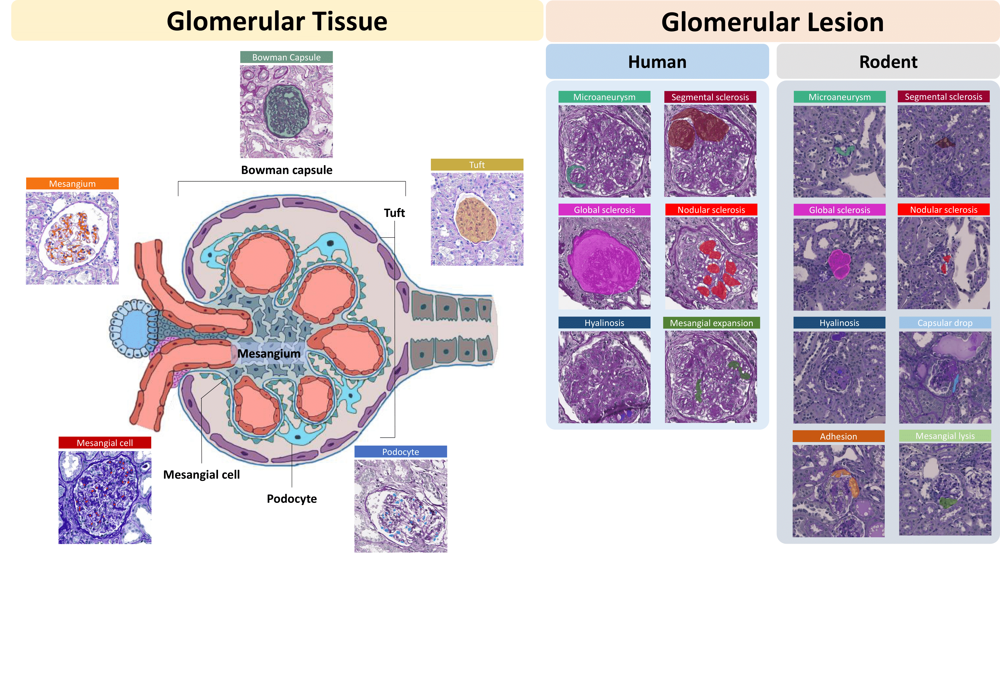
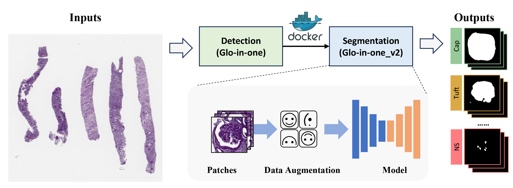

# Glo-In-One-v2: Holistic Identification of Glomerular Cells, Tissues, and Lesions in Human and Mouse Histopathology
The official implementation of Glo-In-One-v2






## Abstract

Segmenting glomerular tissue and lesions typically requires meticulous morphological analysis by expert nephropathologists, a time-intensive process with notable interobserver variability. Building on our previously developed Glo-In-One toolkit, this study introduces Glo-In-One version 2, featuring enhanced segmentation capabilities with 14 distinct labels for tissue regions, cells, and lesions, applied to a dataset of 23,529 annotated glomeruli from human and mouse histopathology images—the largest dataset of its kind to date. We implemented a deep learning model with a single dynamic head architecture to segment 14 classes within partially labeled images, covering five primary renal structures (Bowman’s capsule, glomerular tuft, mesangium, mesangial cells, and podocytes) and nine glomerular lesion types, including global sclerosis, hyaline cap, and segmental sclerosis.
## Installation

Please refer to [INSTALL.md](docs/INSTALL.md) for installation instructions of the detection phase.

## Model
Pretrained model can be found [here](https://drive.google.com/file/d/108uVHgrNBhn-jICiF7WG9SjpmAHJdU1W/view?usp=sharing).

[//]: # (## Data)

[//]: # (The collected glomerulus from web imaging for self-supervised learning can be found [here]&#40;https://data.mendeley.com/datasets/rpbz266jn9/1&#41;.)

## Glo-In-One_v2 - Demo for Segmentation Section

Run demo for testing patches

```
python Glo_v2_segmentation.py --dataset_dir [Your Patch Folder] --reload_path .[Your PTH Folder] --output_folder [Your Output Folder]
```


[//]: # (## Glo-In-One_v2 - Image Demo)

[//]: # ()
[//]: # (For glomerulus detection, run )

[//]: # ()
[//]: # (```)

[//]: # (python run_detection.py circledet --load_model ../model/detection_model.pth --filter_boarder --demo ../demo.svs --demo_dir ../output)

[//]: # (```)

[//]: # ()
[//]: # (For lesion characterization, run)

[//]: # ()
[//]: # (```)

[//]: # (python generate_patches.py ../demo.svs ../output)

[//]: # (python filter_patches_5c.py --case ../demo.svs --output_dir ../output --checkpoint ../model/classifier_model.pth.tar)

[//]: # (python filter_xml_5c.py  ../demo.svs ../output)

[//]: # (```)

[//]: # ()
[//]: # (For generating segment mask, run)

[//]: # ()
[//]: # (```)

[//]: # (python segmentation.py --rootdir ../output --wsi ../demo.svs --model ../model/segmentation_model.pth)

[//]: # (```)

## Glo-In-One_v2 (Detection + Segmentation)
### Quick start

#### Get our docker image

```
sudo docker pull hrlblab333/public:glo_in_one_v2
```
#### Run Glo-In-One
You can run the following command or change the `input_dir`, then you will have the final segmentation results in `output_dir`
```
# you need to specify the input directory
export input_dir=/home/input_dir   
# make that directory
sudo mkdir $input_dir
# put WSIs to the $input_dir directly without subfolders
# set output directory
export output_dir=$input_dir/output
#run the docker if your input_dir contains WSIs
sudo nvidia-docker run -it --rm --shm-size=8g -v $input_dir:/INPUTS/ -v $output_dir:/OUTPUTS hrlblab333/public:glo_in_one_v2 /Glo-In-One_v2/glo-in-one_v2.sh
```
